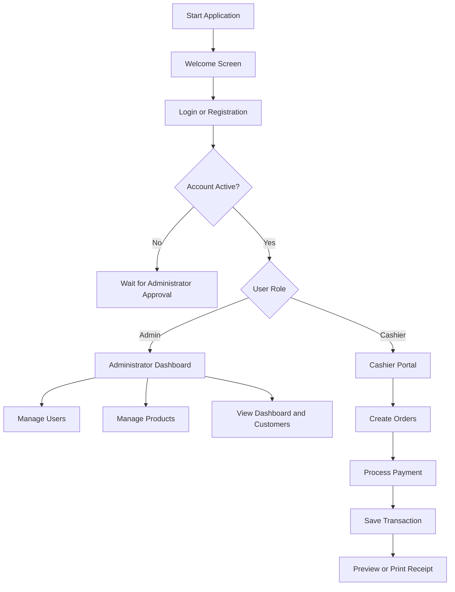

# Cozy Café Management System


A role-based desktop application for managing the daily operations of a cafe. The system was developed in **C# with Windows Forms and SQL Server**.

The application provides separate portals for administrators and cashiers, allowing users to manage staff accounts, products, orders, payments, customer transactions, and business summary data through a graphical desktop interface.

## Table of Contents

- [Features](#features)
- [Application Workflow](#application-workflow)
- [Technology Stack](#technology-stack)
- [Object-Oriented Design](#object-oriented-design)
- [Project Structure](#project-structure)
- [Database Structure](#database-structure)
- [Getting Started](#getting-started)
- [Default Administrator Account](#default-administrator-account)
- [Known Limitations](#known-limitations)
- [Future Improvements](#future-improvements)
- [Contributors](#contributors)
- [Acknowledgements](#acknowledgements)
- [License](#license)

## Features

### Authentication and Access Control

- User registration and login
- Password confirmation and basic input validation
- Role-based navigation for **Admin** and **Cashier** accounts
- New cashier accounts remain in an approval state until activated by an administrator
- Active-account validation during login
- Show or hide password controls

### Administrator Portal

- View dashboard information, including:
  - Total cashiers
  - Total customers
  - Today's income
  - Total income
- Add, update, and delete user accounts
- Assign user roles and account statuses
- Add, update, and remove cafe products
- Manage product information such as:
  - Product ID
  - Product name
  - Category or type
  - Stock quantity
  - Price
  - Availability status
- View customer transaction records

### Cashier Portal

- Browse available products by category
- Select products and quantities
- Add items to an order
- Remove items from an order
- Calculate order totals
- Accept a payment amount and calculate change
- Save completed customer transactions
- View customer transaction history
- Generate and preview printable receipts

### User Interface

- Windows Forms desktop interface
- Separate Admin and Cashier dashboards
- DataGridView-based product, user, order, and customer tables
- Custom UI components and animations
- Confirmation dialogs for important actions

## Application Workflow



## Technology Stack

| Technology | Purpose |
|---|---|
| C# | Main programming language |
| .NET Framework 4.7.2 | Application runtime |
| Windows Forms | Desktop graphical user interface |
| ADO.NET | Database communication |
| Microsoft SQL Server | Persistent data storage |
| Visual Studio | Development environment |
| Guna UI2 WinForms | Enhanced Windows Forms controls |
| CircularProgressBar | Dashboard progress components |
| WinFormAnimation | Interface animations |

## Object-Oriented Design

The project demonstrates core object-oriented programming concepts through separate forms, user controls, and data-model classes.

- **Encapsulation:** Data fields are exposed through class properties.
- **Abstraction:** Database records are represented by dedicated classes such as `AdminAddProductsData`, `adminAddUserData`, `CashierOrdersData`, and `CustomersData`.
- **Modularity:** Administrative, cashier, authentication, product, order, and customer functionality are separated into different classes and forms.
- **Reusability:** Data-loading methods return reusable collections that can be bound to Windows Forms controls.
- **Event-driven programming:** User actions are handled through Windows Forms events such as button clicks, selection changes, and keyboard input.

## Project Structure

```text
CAFE MANAGEMENT SYSTEM/
├── CAFE MANAGEMENT SYSTEM.sln
├── SQLQuery1.sql
├── SQLQuery4.sql
├── CAFE MANAGEMENT SYSTEM/
│   ├── Program.cs
│   ├── Welcome.cs
│   ├── login.cs
│   ├── RegisterForm.cs
│   ├── GroupMembers.cs
│   ├── adminDashboard.cs
│   ├── adminDashboardForm.cs
│   ├── adminAddUser.cs
│   ├── adminAddUserData.cs
│   ├── AdminAddProducts.cs
│   ├── AdminAddProductsData.cs
│   ├── CashierMainForm.cs
│   ├── CashierOrderForm.cs
│   ├── CashierOrderFormProdData.cs
│   ├── CashierOrdersData.cs
│   ├── CashierCustomersForm.cs
│   ├── CustomersData.cs
│   ├── App.config
│   ├── packages.config
│   ├── ASSETS/
│   ├── Product_Directory/
│   ├── Properties/
│   └── Resources/
└── packages/
```

## Database Structure

The application uses a SQL Server database containing the following main tables.

### `project_user`

Stores authentication and account-management information.

| Column | Description |
|---|---|
| `id` | Primary key |
| `username` | Login username |
| `password` | Account password |
| `profile_image` | Optional profile-image path |
| `role` | Admin or Cashier |
| `status` | Active, Approval, or another account state |
| `date_reg` | Registration date |

### `products2`

Stores products available in the cafe.

| Column | Description |
|---|---|
| `id` | Primary key |
| `prod_id` | Product identifier |
| `prod_name` | Product name |
| `prod_type` | Product category |
| `prod_stock` | Available stock |
| `prod_price` | Unit price |
| `prod_status` | Availability status |
| `date_insert` | Creation date |
| `date_update` | Last update date |
| `date_delete` | Soft-deletion date |

### `orders`

Stores the items associated with cashier orders.

| Column | Description |
|---|---|
| `id` | Primary key |
| `customer_id` | Customer or transaction identifier |
| `prod_id` | Product identifier |
| `prod_name` | Product name |
| `prod_type` | Product category |
| `prod_price` | Item price |
| `qty` | Ordered quantity |
| `order_date` | Order date |
| `delete_order` | Optional deletion date |

### `customers`

Stores completed payment and transaction information.

| Column | Description |
|---|---|
| `id` | Primary key |
| `customer_id` | Customer or transaction identifier |
| `total_price` | Total bill amount |
| `amount` | Amount received from the customer |
| `change` | Change returned to the customer |
| `date` | Transaction date |

## Getting Started

### Prerequisites

Install the following software before running the project:

- Windows 10 or Windows 11
- Visual Studio 2019 or Visual Studio 2022
- The **.NET desktop development** workload
- .NET Framework 4.7.2 Developer Pack
- Microsoft SQL Server Express, Developer, or a compatible SQL Server edition
- SQL Server Management Studio, recommended for database setup

### 1. Clone the Repository

```bash
git clone https://github.com/diptaPrattoy/cafe-management-system.git
cd cafe-management-system
```

### 2. Open the Solution

Open the following solution file in Visual Studio:

```text
CAFE MANAGEMENT SYSTEM/CAFE MANAGEMENT SYSTEM.sln
```

### 3. Restore NuGet Packages

Visual Studio should restore the required packages automatically. When it does not, use:

```text
Tools → NuGet Package Manager → Restore NuGet Packages
```

Required packages:

- `Guna.UI2.WinForms` version `2.0.4.6`
- `CircularProgressBar` version `2.8.0.16`
- `WinFormAnimation` version `1.6.0.4`

### 4. Create the Database

Create a SQL Server database named:

```sql
CREATE DATABASE cafe2;
```

The repository includes `SQLQuery1.sql` and `SQLQuery4.sql` as development scripts. Review the scripts before executing them because they contain duplicated statements, sample queries, and destructive commands such as `DROP TABLE`.

Create the following required tables from the appropriate `CREATE TABLE` sections:

- `project_user`
- `products2`
- `orders`
- `customers`

Do not execute the entire development script without reviewing it first.

### 5. Configure the SQL Server Connection

The original project contains connection strings tied to the development computer. Search the solution for:

```text
Data Source=DIPTA-KARMAKAR\SQLEXPRESS
```

Replace each occurrence with the SQL Server instance available on your computer. A local SQL Server Express example is:

```csharp
Data Source=.\SQLEXPRESS;Initial Catalog=cafe2;Integrated Security=True;TrustServerCertificate=True;
```

Also update the connection string in `App.config` so that its database name and SQL Server instance match the values used by the C# source files.

> Recommended improvement: move every connection string into `App.config` and read it through `ConfigurationManager` instead of keeping duplicate connection strings in multiple classes.

### 6. Build and Run

In Visual Studio:

1. Select **Build → Build Solution**.
2. Set `CAFE MANAGEMENT SYSTEM` as the startup project when necessary.
3. Press `F5` to run with debugging or `Ctrl + F5` to run without debugging.

## Default Administrator Account

The included development SQL contains the following sample administrator account:

| Field | Value |
|---|---|
| Username | `Admin` |
| Password | `admin123` |
| Role | `Admin` |
| Status | `Active` |

This account is intended only for local demonstration. Change the password before sharing a configured database.

## Known Limitations

This repository represents an academic learning project and is not production-ready.

- Database connection strings are hard-coded in several classes.
- Passwords are stored and compared as plain text.
- Some SQL commands are created using string interpolation instead of fully parameterized queries.
- The database scripts contain duplicated development statements and require cleanup.
- Some database and column names are inconsistent across development files.
- Input validation and exception handling can be improved.
- The application is designed for Windows and requires SQL Server.
- Automated tests are not currently included.

## Future Improvements

- Store connection settings only in `App.config`.
- Hash and salt passwords with a secure password-hashing algorithm.
- Parameterize every SQL query.
- Add a clean database migration or schema script.
- Introduce repository and service layers to separate UI and database logic.
- Use transactions when processing payments and updating stock.
- Add product images and inventory alerts.
- Add sales reports with date and product filters.
- Export transaction reports to PDF or CSV.
- Add unit and integration tests.
- Improve validation and centralized exception logging.
- Package the application with an installer.

## Contributors

This project was developed as a group assignment for the Object-Oriented Programming 2 course.

| Contributor | Student ID |
|---|---|
| Dipta Prattoy Karmakar | 23-51069-1 |
| Ayon Kumar Bhowmick Ovi | 23-51050-1 |
| Md Rahidul Islam | 23-51269-1 |
| Sumiya Haider Risa | 23-50860-1 |

## Acknowledgements

- Course instructors for guidance on C#, object-oriented programming, Windows Forms, and database integration
- The developers of Guna UI2 WinForms, CircularProgressBar, and WinFormAnimation
- The creators of the visual assets used in the application's interface

## License

No open-source license has been added to this project yet. Unless a license is included, the source code remains under the copyright of its contributors and should not be reused without permission.

For an open-source release, add an appropriate `LICENSE` file, such as the MIT License, after all contributors agree to the licensing terms.
